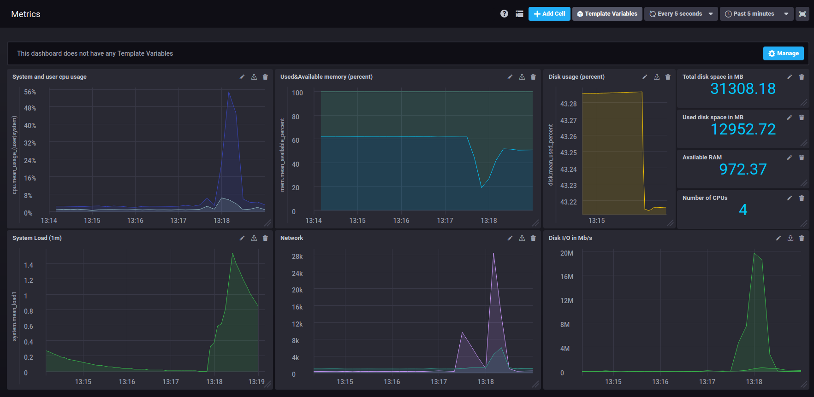

# TICK Sandbox

This repo is a quick way to get the entire TICK Stack spun up and working together. It uses [docker](https://www.docker.com/) to spin up the full TICK stack in a connected fashion. This is heavily tested on Mac and should mostly work on linux and Windows.

To get started you need a running docker installation. If you don't have one, you can download Docker for [Mac](https://www.docker.com/docker-mac) or [Windows](https://www.docker.com/docker-windows), or follow the installation instructions for Docker CE for your [Linux distribution](https://docs.docker.com/engine/installation/#server).

### Running 

To run the `sandbox`, simply use the convenient cli:

```bash
$ ./sandbox
sandbox commands:
  up           -> spin up the sandbox environment
  down         -> tear down the sandbox environment
  restart      -> restart the sandbox
  influxdb     -> attach to the influx cli
  
  enter (influxdb||kapacitor||chronograf||telegraf) -> enter the specified container
  logs  (influxdb||kapacitor||chronograf||telegraf) -> stream logs for the specified container
  
  delete-data  -> delete all data created by the TICK Stack
  docker-clean -> stop and remove all running docker containers
  rebuild-docs -> rebuild the documentation container to see updates
```

To get started just run `./sandbox up`. You browser will open two tabs:

- `localhost:8888` - Chronograf's address. You will use this as a management UI for the full stack
- `localhost:3000` - Documentation server. This contains a simple markdown server for tutorials and documentation.

> NOTE: Make sure to stop any existing installations of `influxdb`, `kapacitor` or `chronograf`. If you have them running the sandbox will run into port conflicts and fail to properly start. In this case stop the existing processes and run `./sandbox restart`.

To configure the connection to InfluxDB from Chronograf just fill in `http://influxdb:8086` as the URL:


Once you have configured the InfluxDB URL you should see your dashboard:


Then click on the gear icon and select `Kapacitor`:


Finally, enter `http://kapacitor:9092` as the URL and click `Connect Kapacitor`:


Then you are ready to get started with the TICK Stack!

Visit `http:localhost:8888` and click the host to see your dashboard, then check out the tutorials at `http://localhost:3000/tutorials`.

>Note: see [influx-stress](https://github.com/influxdata/influx-stress) to create data for your sandbox. 
>


# Restore the dashboard

Easiest way to get the same dashboard in the above example is to follow the guide here https://www.influxdata.com/blog/chronograf-dashboard-definitions/ and populating your own dashboard from my json dump available in the all_dashboards.json file.

## Or you can also choose to create your own dashboard
Following queries can be used to create a dashboard that is similar to the one shown above

### System and user cpu usage

```SELECT mean("usage_user") AS "mean_usage_user", mean("usage_system") AS "mean_usage_system" FROM "telegraf"."autogen"."cpu" WHERE time > :dashboardTime: AND "host"='raspberrypi' GROUP BY time(10s) FILL(null)```

### Used&Available memory (percent)

```SELECT mean("available_percent") AS "mean_available_percent", mean("used_percent") AS "mean_used_percent" FROM "telegraf"."autogen"."mem" WHERE time > :dashboardTime: AND "host"='raspberrypi' GROUP BY time(10s) FILL(null)```

### Disk usage (percent)

```SELECT mean("used_percent") AS "mean_used_percent" FROM "telegraf"."autogen"."disk" WHERE time > :dashboardTime: AND "host"='raspberrypi' GROUP BY :interval: FILL(null)```

### Total disk space in MB

```SELECT mean("total") / 1000000 AS "mean_total" FROM "telegraf"."autogen"."disk" WHERE time > :dashboardTime: AND "host"='raspberrypi' GROUP BY time(10s) FILL(previous)```

### Used disk space in MB

```SELECT last("used") / 1000000 AS "last_used" FROM "telegraf"."autogen"."disk" WHERE time > :dashboardTime: AND "host"='raspberrypi' GROUP BY time(10s) FILL(previous)```

### Available RAM

```SELECT last("total") / 1000000 AS "last_total" FROM "telegraf"."autogen"."mem" WHERE time > :dashboardTime: GROUP BY time(10s) FILL(previous)```

### Number of CPUs

```SELECT last("n_cpus") AS "last_n_cpus" FROM "telegraf"."autogen"."system" WHERE time > :dashboardTime: AND "host"='raspberrypi' GROUP BY time(10s) FILL(previous)```

### System Load (1m)

```SELECT mean("load1") AS "mean_load1" FROM "telegraf"."autogen"."system" WHERE time > :dashboardTime: AND "host"='raspberrypi' GROUP BY :interval: FILL(null)```

### Network

```SELECT derivative(sum("bytes_sent"), 1s) AS "bytes_sent_per_sec", derivative(sum("bytes_recv"), 1s) AS "bytes_recv_per_sec" FROM "telegraf"."autogen"."net" WHERE time > :dashboardTime: GROUP BY time(1s)```

### Disk I/O in Mb/s

```SELECT derivative(sum("read_bytes"), 1s) AS "mean_read_mbps", derivative(sum("write_bytes"), 1s)  AS "mean_write_mbps" FROM "telegraf"."autogen"."diskio" WHERE time > :dashboardTime: AND "host"='raspberrypi' GROUP BY time(1s)```
